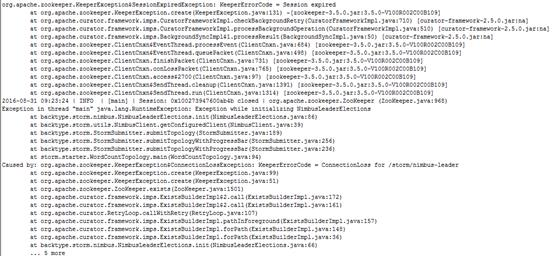

# 提交拓扑失败

## 问题背景与现象

使用MRS流式集群，主要安装ZooKeeper、Storm、Kafka。

使用客户端命令，提交Topology失败。

## 可能原因

-   Storm服务异常。
-   客户端用户没有进行安全认证或者认证过期。
-   提交拓扑中包含storm.yaml文件和服务端冲突。

## 原因分析

用户提交拓扑失败，可能原因客户端侧问题或者Storm侧问题。

1.  通过MRS Manager页面，选择“服务管理 \> Storm”，查看Storm服务当前状态，发现状态为“良好”，且监控指标内容显示正确。

    **图 1**  Storm当前状态  
    

2.  查看客户端提交日志，发现打印KeeperExceptionSessionExpireException异常信息，如下所示：

    

    上述错误是由于在提交拓扑之前没有进行安全认证或者认证后TGT过期导致。

    解决方法参考[1](#zh-cn_topic_0167274657_li3441354713597)。

3.  查看客户端提交日志，发现打印ExceptionInIntializerError异常信息，提示Found multiple storm.yaml resources。如下所示：

    

    该错误是由于业务jar包中存在storm.yaml文件，和服务端的storm.yaml文件冲突导致的。

    解决方法参考[2](#zh-cn_topic_0167274657_lb9002e19ff8145bdade3ec76bb7e50e4)。

4.  如果不是上述原因，则请参考[提交拓扑失败，提示Failed to check principle for keytab](提交拓扑失败-提示Failed-to-check-principle-for-keytab.md#ZH-CN_TOPIC_0183415881)。

## 解决办法

1.  认证异常。
    1.  登录客户端节点，进入客户端目录。
    2.  执行以下命令重新提交任务。（业务jar包和Topology根据实际情况替换）

        **source bigdata\_env**

        **kinit** _用户名_

        **storm jar storm-starter-topologies-0.10.0.jar storm.starter.WordCountTopology test**

2.  拓扑包异常。

    排查业务jar，将业务jar中storm.yaml文件删除，重新提交任务。

