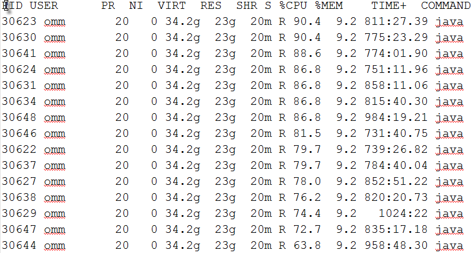

# 无业务情况下，RegionServer占用CPU高

## 问题背景

无业务情况下，RegionServer占用CPU较高。

## 原因分析

1.  通过**top**命令获取RegionServer的进程使用CPU情况信息，查看CPU使用率高的进程号。
2.  根据RegionServer的进程编号，获取该进程下线程使用CPU情况。

    **top -H -p <PID\>**（根据实际RegionServer的进程ID进行替换），具体如下图所示，发现部分线程CPU使用率均达到80%。

    

3.  根据RegionServer的进程编号，获取线程堆栈信息。

    **jstack 12345  \>allstack.txt**  （根据实际RegionServer的进程ID进行替换）

4.  将需要的线程ID转换为16进制格式：

    **printf "%x\\n" 30648**

    输出结果TID为77b8。

5.  根据输出16进制TID，在线程堆栈中进行查找，发现在执行compaction操作。

    

6.  对其它线程执行相同操作，发现均为compactions线程。

    

## 解决办法

属于正常现象。

发现消耗CPU较高线程均为HBase的compaction，其中部分线程调用Snappy压缩处理，部分线程调用HDFS读写数据。当前每个Region数据量和数据文件多，且采用Snappy压缩算法，因此执行compaction时会使用大量CPU导致CPU较高。

## 定位办法

1.  使用**top**命令查看 CPU使用率高的进程号。
2.  查看此进程中占用CPU高的线程。

    使用命令**top -H -p <PID\>**即可打印出某进程<PID\>下的线程的CPU耗时信息。

    一般某个进程如果出现问题，是因为某个线程出现问题了，获取查询到的占用CPU最高的线程号。

    或者使用命令**ps -mp <PID\> -o THREAD,tid,time | sort -rn**。

    观察回显可以得到CPU最高的线程号。

3.  获取出现问题的线程的堆栈。

    java问题使用jstack工具是最有效，最可靠的。

    到java/bin目录下有 jstack工具，获取进程堆栈，并输出到本地文件。

    **jstack <PID\> \> allstack.txt**

    获取线程堆栈，并输出到本地文件。

4.  将需要的线程ID转换为16进制格式。

    **printf "%x\\n" <PID\>**

    回显结果为线程ID，即 TID。

5.  使用命令获得TID,并输出到本地文件。

    **jstack <PID\> | grep <TID\> \> Onestack.txt**

    如果只是在命令行窗口查看，可以使用命名：

    **jstack <PID\> | grep <TID\> -A 30**

    -A 30意思是显示30行。

