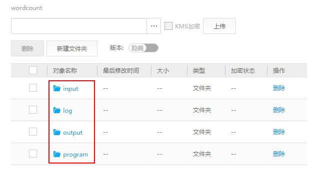
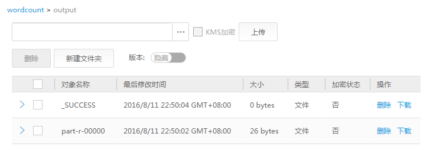

# 从零开始使用Hadoop<a name="ZH-CN_TOPIC_0173178039"></a>

本章节提供从零开始使用Hadoop提交wordcount作业的操作指导，wordcount是最经典的Hadoop作业，它用来统计海量文本的单词数量。

## 操作步骤<a name="saf50f0a3153d4dff94e983737fcd55ae"></a>

1.  <a name="le287346e84914cffadab7f39de92b68d"></a>准备wordcount程序。

    开源的Hadoop的样例程序包含多个例子，其中包含wordcount。可以从[https://dist.apache.org/repos/dist/release/hadoop/common/](https://dist.apache.org/repos/dist/release/hadoop/common/)中下载Hadoop的样例程序。

    例如，选择hadoop-2.7.x版本，下载“hadoop-2.7.x.tar.gz“，解压后在“hadoop-2.7.x\\share\\hadoop\\mapreduce“路径下获取“hadoop-mapreduce-examples-2.7.x.jar“，即为Hadoop的样例程序。“hadoop-mapreduce-examples-2.7.x.jar“样例程序包含了wordcount程序。

    > **说明：**   
    >hadoop-2.7.x表示Hadoop的版本号。  

2.  <a name="l8608e4e8ac884c7a919ca1928791488c"></a>准备数据文件。

    数据文件无格式要求，准备一个或多个txt文件即可，如下内容为txt文件样例：

    ```
    qwsdfhoedfrffrofhuncckgktpmhutopmma
    jjpsffjfjorgjgtyiuyjmhombmbogohoyhm
    jhheyeombdhuaqqiquyebchdhmamdhdemmj
    doeyhjwedcrfvtgbmojiyhhqssddddddfkf
    kjhhjkehdeiyrudjhfhfhffooqweopuyyyy
    ```

3.  上传数据至OBS。
    1.  登录OBS控制台。
    2.  单击“创建桶“，创建一个名称为wordcount的桶。

        wordcount仅为示例，桶名称必须全局唯一，否则会创建桶失败。

    3.  在wordcount桶下单击“新建文件夹“，分别创建program、input、output和log文件夹，创建完成后如[图1](#f5b788a3e684449bbb706e7ed88f3ceee)所示。

        **图 1**  wordcount桶文件夹列表<a name="f5b788a3e684449bbb706e7ed88f3ceee"></a>  
        

        -   program：存放用户程序
        -   input：存放用户数据文件
        -   output：存放作业输出的文件
        -   log：存放作业输出的日志文件

    4.  进入program文件夹，单击，从本地选择[1](#le287346e84914cffadab7f39de92b68d)中下载的程序包，然后单击“上传“，上传完成后如[图2](#fa54363aacb7640879f2f7d041a36e3fe)所示。

        **图 2**  程序列表<a name="fa54363aacb7640879f2f7d041a36e3fe"></a>  
        

    5.  进入input文件夹，将[2](#l8608e4e8ac884c7a919ca1928791488c)中准备的数据文件上传到input文件夹，上传完成后如[图3](#f0e55f4ecae264fe0ad38e57eec115caa)所示。

        **图 3**  数据文件列表<a name="f0e55f4ecae264fe0ad38e57eec115caa"></a>  
        

4.  登录MRS控制台，在左侧导航栏选择“集群列表 \> 现有集群”，单击名称为“mrs\_20160907“的集群。“mrs\_20160907“集群为[创建集群](创建集群-入门.md)中创建的集群。
5.  提交wordcount作业。

    在MRS控制台选择“作业管理“页签，单击“添加“，进入“添加作业“页面，具体请参见[运行MapReduce作业](运行MapReduce作业.md)。

    只有“mrs\_20160907“集群处于“运行中“状态时才能提交作业。

    作业提交成功后默认为“运行中“状态，不需要用户手动执行作业。

6.  查看作业执行结果。
    1.  进入“作业管理“页面，查看作业是否执行完成。

        作业运行需要时间，作业运行结束后，刷新作业列表，查看作业列表如[图4](#fc74e09fd0d7f41c8b061b802b7511799)所示。

        **图 4**  作业列表<a name="fc74e09fd0d7f41c8b061b802b7511799"></a>  
        

        作业执行成功或失败后都不能再次执行，只能新增或者复制作业，配置作业参数后重新提交作业。

    2.  登录OBS控制台，进入OBS路径，查看作业输出信息。

        可以到OBS中的“wordcount \> output“目录中查看相关的output文件，需要下载到本地以文本方式打开进行查看，如[图5](#fbf08cc0204524993bf5e047668bfc9f3)所示。

        **图 5**  输出文件列表<a name="fbf08cc0204524993bf5e047668bfc9f3"></a>  
        

    3.  登录OBS控制台，进入OBS路径，查看作业执行的详细日志信息。

        可以到OBS中的“wordcount \> log“目录中根据作业ID查询作业执行详细日志，需要下载到本地以文本方式打开进行查看，如[图6](#f74356c7b1f26401e8a54c6790594b39d)所示。

        **图 6**  日志列表<a name="f74356c7b1f26401e8a54c6790594b39d"></a>  
        

7.  删除集群。

    请参见《用户指南》中的[删除集群](删除集群.md)章节。


