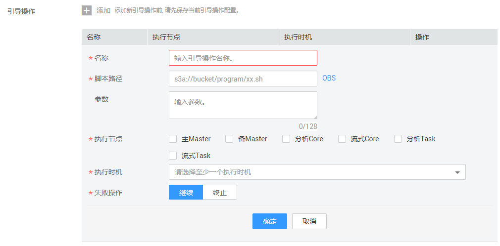

# 添加引导操作

1.  登录管理控制台。
2.  选择“EI企业智能 \> MapReduce服务”。
3.  单击“购买集群”，进入“购买集群“页面。
4.  在“高级配置“页签，选择“现在配置“，展开引导操作页签。
5.  在“引导操作“页签中单击“添加“。系统显示如下图所示：

    **图 1**  添加引导操作  
    

    **表 1**  参数描述

    
    <table><thead align="left"><tr id="row1574783017401"><th class="cellrowborder" valign="top" width="27%" id="mcps1.2.3.1.1">
参数

    </th>
    <th class="cellrowborder" valign="top" width="73%" id="mcps1.2.3.1.2">
说明

    </th>
    </tr>
    </thead>
    <tbody><tr id="row77471830174011"><td class="cellrowborder" valign="top" width="27%" headers="mcps1.2.3.1.1 ">
名称

    </td>
    <td class="cellrowborder" valign="top" width="73%" headers="mcps1.2.3.1.2 ">
引导操作脚本的名称。

    
只能由数字、英文字符、空格、中划线和下划线组成，且不能以空格开头。

    
可输入的字符串长度为1～64个字符。

    
 说明： 

同一集群内，不允许配置相同的名称。不同集群之间，可以配置相同的名称。

    

    </td>
    </tr>
    <tr id="row374783034013"><td class="cellrowborder" valign="top" width="27%" headers="mcps1.2.3.1.1 ">
脚本路径

    </td>
    <td class="cellrowborder" valign="top" width="73%" headers="mcps1.2.3.1.2 ">
脚本的路径。路径可以是OBS桶的路径或虚拟机本地的路径。

    <ul id="ul107475303406"><li>OBS桶的路径，必须以s3a://开头，以.sh结尾。如zeppelin安装示例脚本：s3a://mrs-samples-bootstrap-cn-north-1/zeppelin/zeppelin_install.sh</li><li>虚拟机本地的路径，脚本所在的路径必须以‘/’开头，以.sh结尾。</li></ul>
    </td>
    </tr>
    <tr id="row274823064014"><td class="cellrowborder" valign="top" width="27%" headers="mcps1.2.3.1.1 ">
执行节点

    </td>
    <td class="cellrowborder" valign="top" width="73%" headers="mcps1.2.3.1.2 ">
选择引导操作脚本所执行的节点类型。

    
 说明： 
<ul id="ul15748173016400"><li>如果选择Master节点，您可以通过选择是否只在Active Master节点执行此脚本。</li><li>如果选择开启此功能，表示只在Active Master节点上执行。如果选择关闭，表示在所有Master节点执行。默认关闭。</li></ul>
    

    </td>
    </tr>
    <tr id="row27481330124012"><td class="cellrowborder" valign="top" width="27%" headers="mcps1.2.3.1.1 ">
参数

    </td>
    <td class="cellrowborder" valign="top" width="73%" headers="mcps1.2.3.1.2 ">
引导操作脚本参数。

    </td>
    </tr>
    <tr id="row15749153054013"><td class="cellrowborder" valign="top" width="27%" headers="mcps1.2.3.1.1 ">
执行时机

    </td>
    <td class="cellrowborder" valign="top" width="73%" headers="mcps1.2.3.1.2 ">
选择引导操作脚本执行的时间。目前支持“组件启动前”和“组件启动后”两种类型。

    </td>
    </tr>
    <tr id="row474917307402"><td class="cellrowborder" valign="top" width="27%" headers="mcps1.2.3.1.1 ">
失败操作

    </td>
    <td class="cellrowborder" valign="top" width="73%" headers="mcps1.2.3.1.2 ">
该脚本执行失败后，是否继续执行后续脚本和创建集群。
 说明： 

建议您在调试阶段设置为“继续”，无论此引导操作是否执行成功，则集群都能继续安装和启动。

    

    

    </td>
    </tr>
    </tbody>
    </table>

6.  单击“确定”。系统显示如下：

    **图 2**  引导操作  
    

    > **说明：**   
    >添加成功后，可以通过“操作”列进行编辑或者删除。  

